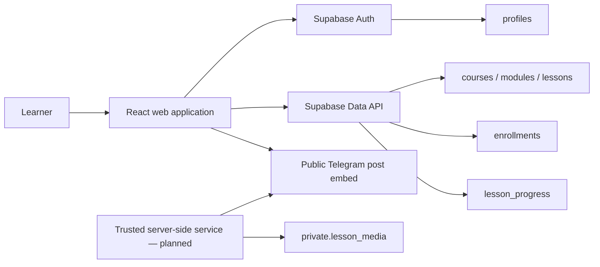

# GloryTech Academy

GloryTech Academy is an Arabic-first, right-to-left learning management system for practical networking, infrastructure, and DevOps education.

The platform is built around the training content of Eng. Mohamed Bashir Al-Misrati. It currently presents two free learning tracks and is structured to support new courses without redesigning the application.

> Current hosted preview: [glorytech-academy.mohamed-kbay.chatgpt.site](https://glorytech-academy.mohamed-kbay.chatgpt.site) — access may be restricted.

## Course Catalog

| Course | Status | Level |
| --- | --- | --- |
| Networking Foundations — CCNA | Available · Free | Beginner |
| Enterprise Networking | Available · Free | Intermediate |
| DevOps Bootcamp | Coming soon | Intermediate to advanced |
| CCNP Enterprise | Coming soon | Advanced |

## Current Features

- Responsive Arabic RTL landing page and course catalog
- Searchable, database-ready course listing
- Course details, modules, lessons, and learning outcomes
- Passwordless email OTP registration and sign-in flow
- Required full name, phone number, and email during registration
- Optional school, university, or employer field
- Protected student dashboard and lesson routes
- Free-course enrollment and per-lesson completion tracking
- Telegram lesson posts embedded inside the learning interface
- Instructor biography and professional certification showcase
- Visible but non-enrollable coming-soon courses
- Local fallback catalog and demo mode when Supabase is not configured

## Technology Stack

- React 18
- Vite 8
- React Router
- Tailwind CSS
- Framer Motion
- Supabase JS
- PostgreSQL with Row-Level Security
- Cloudflare Worker-compatible production build

## Application Routes

| Route | Purpose |
| --- | --- |
| `/` | Landing page and course catalog |
| `/login` | Account registration, OTP verification, and sign-in |
| `/courses/:slug` | Course information and curriculum |
| `/dashboard` | Protected student dashboard |
| `/learn/:slug/:lessonId` | Protected lesson player |
| `/404` | Not-found page |

## Backend Status

The frontend integration, database schema, migrations, email template, and Row-Level Security policies are included in this repository. A dedicated hosted Supabase project, production SMTP provider, and deployment environment variables still need to be provisioned before real learners can register and persist their progress.

Without Supabase environment variables, the application intentionally runs in demo mode.

## Planned Backend Architecture



### Authentication Flow

1. A learner submits an email address.
2. New accounts also provide a full name and phone number; affiliation is optional.
3. Supabase sends a six-digit email OTP.
4. A database trigger validates the registration metadata and creates the learner profile.
5. OTP verification creates an authenticated session.
6. The learner can access the protected dashboard and lesson player.

Existing-account login uses `shouldCreateUser: false`, preventing accidental account creation from the login form.

### Data Model

| Table | Responsibility |
| --- | --- |
| `profiles` | Learner name, phone number, avatar, and optional affiliation |
| `courses` | Course metadata, publication state, availability, price state, and cover image |
| `modules` | Ordered sections within a course |
| `lessons` | Ordered lesson metadata and optional Telegram message reference |
| `enrollments` | Learner-to-course enrollment records |
| `lesson_progress` | Learner-owned progress and completion records |
| `private.lesson_media` | Provider metadata reserved for trusted server-side media delivery |

### Row-Level Security

All browser-accessible tables have Row-Level Security enabled.

- Visitors and authenticated learners can read published courses.
- Modules and lessons are readable only for published, available courses.
- Learners can only read and update their own profile.
- Learners can only read their own enrollments and progress.
- Enrollment is restricted to published, available, free courses.
- Progress writes require a matching enrollment.
- The `private` media schema is inaccessible to browser roles and reserved for trusted server-side access.

Never expose a Supabase secret/service-role key or a Telegram bot token in the frontend.

## Telegram Video Delivery

The current free-course player can embed posts from a public Telegram channel directly inside the platform.

Set the public channel username:

```env
VITE_TELEGRAM_CHANNEL=your_public_channel
```

Then store each post number in `lessons.telegram_message_id`.

Public Telegram embeds are convenient for free material, but they are not protected video storage. Private or paid content will require a trusted server-side delivery layer with signed playback URLs or a dedicated HLS/CDN provider. The existing `private.lesson_media` table prepares the data model for this future architecture.

## Local Development

### Requirements

- Node.js 22 or newer
- npm
- Supabase CLI and Docker Desktop when running the backend locally

```bash
git clone git@github.com:mohamedkbay/glory-platform.git
cd glory-platform

npm ci
cp .env.example .env
npm run dev
```

The development server runs at `http://localhost:5173`.

## Environment Variables

```env
VITE_SUPABASE_URL=https://your-project-ref.supabase.co
VITE_SUPABASE_PUBLISHABLE_KEY=sb_publishable_replace_me
VITE_TELEGRAM_CHANNEL=
VITE_CONTACT_EMAIL=
```

Only browser-safe public values belong in `.env`. Local environment files are ignored by Git.

## Supabase Setup

### Local Backend

```bash
supabase start
supabase migration up --local
supabase status
```

Use the local API URL and browser-safe key reported by the CLI in your `.env` file.

### Hosted Backend

```bash
supabase login
supabase link --project-ref YOUR_PROJECT_REF
supabase db push --dry-run
supabase db push
```

After applying the migrations:

1. Configure the production Site URL and permitted redirect URLs.
2. Connect a production SMTP provider.
3. Configure the Magic Link email template to include `{{ .Token }}` so Supabase sends a numeric OTP.
4. Add the hosted Supabase URL and publishable key to the frontend environment.
5. Populate the Telegram channel username and lesson message IDs.

The repository includes a local OTP template at `supabase/templates/magic_link.html`. A custom SMTP provider is still required for dependable public delivery in production.

## Database Migrations

Migrations are stored in `supabase/migrations` and currently cover:

1. LMS tables, indexes, permissions, RLS policies, and the two initial courses
2. Registration profile fields, validation, and automatic profile creation
3. Course availability states, cover images, DevOps/CCNP placeholders, and stricter availability policies

## Adding or Launching a Course

Create a published course with `availability_status = 'coming_soon'` to display a disabled preview card. When the curriculum is ready, add its modules and lessons and change the status to `available`.

The catalog is ordered by `courses.position`. The student dashboard and database policies keep coming-soon content unavailable until launch.

## Production Build

```bash
npm run build
npm run preview
```

The production output is written to `dist`. The included Worker configuration serves the single-page application with route fallback support.

## Verification

```bash
npm run build
supabase start
supabase migration up --local
supabase db lint --local --schema public,private --fail-on error
supabase stop
```

## Backend Roadmap

- Provision and connect a dedicated Supabase project
- Configure production SMTP and abuse protection for OTP delivery
- Populate real Telegram lesson message IDs
- Add an authenticated instructor/admin interface for publishing courses and lessons
- Add a trusted server-side Telegram or HLS media delivery layer for protected content
- Add automated UI, database, and authorization tests
- Add monitoring, error reporting, and deployment checks
- Expand the catalog while preserving the database-driven course model

## Current Limitations

- Without Supabase environment variables, progress is not persisted.
- Telegram playback currently supports public post embeds only.
- No admin content-management interface exists yet.
- Course and lesson data is currently managed through migrations or Supabase.
- Automated application tests have not been added yet.

## Instructor

GloryTech Academy is led by **Eng. Mohamed Bashir Al-Misrati**, a telecommunications and cloud engineer with professional experience across enterprise networking, security, cloud infrastructure, and virtualization.

## License

No open-source license has been added yet. All rights are reserved by the project owner.
