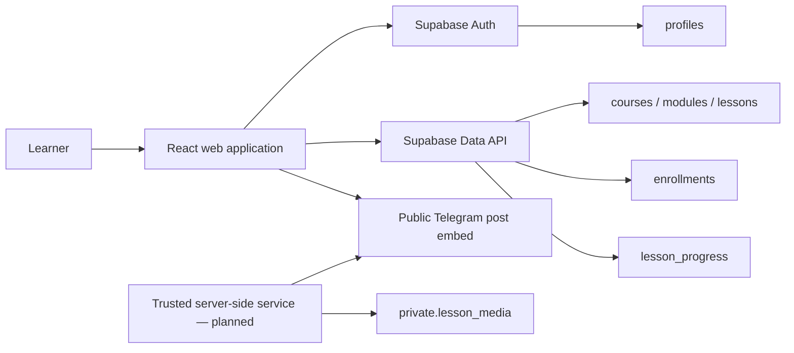

# GloryTech Academy

GloryTech Academy is a bilingual (Arabic RTL / English) learning management system for practical networking, infrastructure, and DevOps education, with light and dark themes.

The platform brings together professional instructors, starting with Eng. Mohamed Bashir Al-Misrati. It currently offers two completely free CCNA courses and supports paid courses with a 70% instructor / 30% platform revenue split.

> Current hosted preview: [glorytech-academy.mohamed-kbay.chatgpt.site](https://glorytech-academy.mohamed-kbay.chatgpt.site) — access may be restricted.

## Course Catalog

| Course | Status | Level |
| --- | --- | --- |
| CCNA1: Introduction to Networks | Available · Free · 18 lessons | Beginner |
| CCNA 4: Connecting Networks | Available · Free · 10 lessons | Intermediate |

Both courses stream their full lesson videos from Google Drive and attach the matching slide deck to each lesson as a download.

The landing page markets sixteen upcoming tracks from `src/data/upcoming.js` (CCNA 200-301, CCNP Enterprise, Red Hat Admin, VMware vSphere, Proxmox, Network Automation, Fortinet NSE 4, Kubernetes, Docker, Ansible, CI/CD, Terraform, Azure AZ-900, Python, SD-WAN, CompTIA Security+).

## Current Features

- Arabic and English interface (`src/i18n`), with RTL/LTR layout switching
- Light (default) and dark themes across every page
- Responsive landing page: courses, upcoming tracks, instructors, Telegram channel, contact
- Searchable, database-ready course listing
- Course details, modules, lessons, and learning outcomes; every lesson in a free course opens directly from the course page
- Passwordless email OTP registration and sign-in flow
- Required full name, phone number, and email during registration
- Optional school, university, or employer field
- Protected student dashboard and lesson routes
- Free-course enrollment and per-lesson completion tracking
- Custom video player streaming lessons through the Worker (source URL never reaches the browser), with a thumbnail preview when hovering the seek bar
- Real lesson durations read from the uploaded video files
- Instructor profiles with their certifications and linked courses
- Instructor portal: create courses, manage lessons, attach the Google Drive video and downloadable resources, learners, analytics and earnings
- Lecture slides attached under each lesson inside the player, with open and download buttons
- Admin dashboard: platform KPIs, course settings (price, split, publishing), learners, instructor settlement, payments and payouts
- Dedicated corporate training page (`/b2b`): delivery formats, a catalogue of 50+ tracks across seven fields, pricing policy and a prefilled request email
- Dedicated instructor recruiting page (`/teach`): fields, requirements and joining steps
- Price shown as an explicit field on course cards (both CCNA courses are free)
- Terms and privacy consent required before sign-up
- Player warns when the browser cannot decode a lesson's video codec instead of showing a black screen
- Local fallback catalog and demo mode when Supabase is not configured

## Technology Stack

- React 18
- Vite 8
- React Router
- Tailwind CSS
- CSS animations (no animation library, keeps the main bundle small)
- Supabase JS
- PostgreSQL with Row-Level Security
- Cloudflare Worker-compatible production build
- Docker image (multi-stage) with runtime configuration injection

## Application Routes

| Route | Purpose |
| --- | --- |
| `/` | Landing page and course catalog |
| `/login` | Account registration, OTP verification, and sign-in |
| `/courses/:slug` | Course information and curriculum |
| `/instructors/:slug` | Instructor profile |
| `/dashboard` | Protected student dashboard |
| `/learn/:slug/:lessonId` | Protected lesson player |
| `/instructor` | Instructor portal (linked instructor accounts) |
| `/instructor/courses/:courseId` | Course, lessons, videos and resources editor |
| `/admin` | Admin dashboard |
| `/admin/instructors/:instructorId` | Admin view of one instructor dashboard |
| `/b2b` | Corporate training (B2B) |
| `/teach` | Instructor recruiting |
| `/legal/:page` | Terms of use and privacy policy |
| `/404` | Not-found page |

## Backend Status

The frontend integration, database schema, migrations, email template, and Row-Level Security policies are included in this repository. A dedicated hosted Supabase project, production SMTP provider, and deployment environment variables still need to be provisioned before real learners can register and persist their progress.

Without Supabase environment variables, the application intentionally runs in demo mode.

## Planned Backend Architecture



### Authentication Flow

1. A learner submits an email address.
2. New accounts also provide a full name and phone number; affiliation is optional.
3. Supabase sends a six-digit email OTP.
4. A database trigger validates the registration metadata and creates the learner profile.
5. OTP verification creates an authenticated session.
6. The learner can access the protected dashboard and lesson player.

Existing-account login uses `shouldCreateUser: false`, preventing accidental account creation from the login form.

### Data Model

| Table | Responsibility |
| --- | --- |
| `profiles` | Learner name, phone number, avatar, and optional affiliation |
| `courses` | Course metadata, publication state, availability, price state, and cover image |
| `modules` | Ordered sections within a course |
| `lessons` | Ordered lesson metadata and optional Telegram message reference |
| `enrollments` | Learner-to-course enrollment records |
| `lesson_progress` | Learner-owned progress and completion records |
| `private.lesson_media` | Provider metadata reserved for trusted server-side media delivery |
| `instructors` | Public instructor profiles (bilingual), optionally linked to a login account |
| `payments` | Course payments in LYD with the instructor and split captured when recorded |
| `payouts` | Money transferred to instructors |
| `private.admins` | Accounts with admin access |
| `lesson_resources` | Downloadable files per lesson (preview lessons are public, the rest need an enrollment) |

Dashboards read aggregated data through `get_dashboard(p_instructor_id)`: admins see the platform (or any instructor), instructors only their own courses. A paid payment enrolls the learner automatically.

### Row-Level Security

All browser-accessible tables have Row-Level Security enabled.

- Visitors and authenticated learners can read published courses.
- Modules and lessons are readable only for published, available courses.
- Learners can only read and update their own profile.
- Learners can only read their own enrollments and progress.
- Enrollment is restricted to published, available, free courses.
- Progress writes require a matching enrollment.
- The `private` media schema is inaccessible to browser roles and reserved for trusted server-side access.

Never expose a Supabase secret/service-role key or a Telegram bot token in the frontend.

## Video Delivery

The player requests `POST /api/lessons/:id/playback` with the learner session. The Worker (`worker/index.js`) checks the session and enrollment with Supabase, then returns a short-lived signed `/api/stream/:token` URL and proxies the video bytes (with Range support) from the source listed in `worker/media.js`. Lesson videos are stored in `private.lesson_media` (set from the instructor portal) and read by the Worker through `get_lesson_video`, which only the service role may call; `worker/media.js` stays as a fallback. Worker secrets go in `.dev.vars` locally (see `.dev.vars.example`) and `wrangler secret put` in production — including `SUPABASE_SERVICE_ROLE_KEY`.

### Edge caching

Google Drive serves files at only a few hundred KB/s, so the Worker caches video bytes at the Cloudflare edge:

- Range requests are snapped to 4 MB chunks, and each chunk is stored once in the edge cache (7 days).
- On a cache miss the learner's bytes stream straight from Drive while the chunk is written to the cache in the background (`ctx.waitUntil`), so the first viewer never waits for a whole chunk.
- The cache key is the Drive file id, not the learner's signed URL, so every learner on the same lesson shares the cached chunks. The browser still receives only a signed, per-learner URL.

Measured locally on a 400 MB lesson: first byte in about 1–2 s on a cold chunk, and about 0.05 s once cached (roughly 400× faster than reading from Drive).

Videos should be H.264 with `+faststart`; see `docs/CONVERT-VIDEOS.md`.

### Telegram embeds (fallback)

The current free-course player can embed posts from a public Telegram channel directly inside the platform.

Set the public channel username:

```env
VITE_TELEGRAM_CHANNEL=your_public_channel
```

Then store each post number in `lessons.telegram_message_id`.

Public Telegram embeds are convenient for free material, but they are not protected video storage. Private or paid content will require a trusted server-side delivery layer with signed playback URLs or a dedicated HLS/CDN provider. The existing `private.lesson_media` table prepares the data model for this future architecture.

## Local Development

### Requirements

- Node.js 22 or newer
- npm
- Supabase CLI and Docker Desktop when running the backend locally

```bash
git clone git@github.com:mohamedkbay/glory-platform.git
cd glory-platform

npm ci
cp .env.example .env
npm run dev
```

The development server runs at `http://localhost:5173`.

## Environment Variables

```env
VITE_SUPABASE_URL=https://your-project-ref.supabase.co
VITE_SUPABASE_PUBLISHABLE_KEY=sb_publishable_replace_me
VITE_TELEGRAM_CHANNEL=
VITE_CONTACT_EMAIL=
```

Only browser-safe public values belong in `.env`. Local environment files are ignored by Git.

## Supabase Setup

### Local Backend

```bash
supabase start
supabase migration up --local
supabase status
```

Use the local API URL and browser-safe key reported by the CLI in your `.env` file.

### Hosted Backend

```bash
supabase login
supabase link --project-ref YOUR_PROJECT_REF
supabase db push --dry-run
supabase db push
```

After applying the migrations:

1. Configure the production Site URL and permitted redirect URLs.
2. Connect a production SMTP provider.
3. Upload `supabase/templates/assets/glorytech-mark.png` to a public Storage bucket named `brand`, then paste `supabase/templates/magic_link.html` (Magic Link) and `supabase/templates/confirmation.html` (Confirm signup) into the Auth email templates, with the subjects from `supabase/config.toml`. Both send a six-digit `{{ .Token }}` code instead of a link.
4. Add the hosted Supabase URL and publishable key to the frontend environment.
5. Populate the Telegram channel username and lesson message IDs.

The repository includes a local OTP template at `supabase/templates/magic_link.html`. A custom SMTP provider is still required for dependable public delivery in production.

## Database Migrations

Migrations are stored in `supabase/migrations` and currently cover:

1. LMS tables, indexes, permissions, RLS policies, and the two initial courses
2. Registration profile fields, validation, and automatic profile creation
3. Course availability states, cover images, DevOps/CCNP placeholders, and stricter availability policies
4. Instructors, admin role, payments/payouts billing, dashboard functions, bilingual fields, and the real CCNA 1 / CCNA 4 lessons
5. Instructor portal: course/lesson authoring policies, lesson videos on Google Drive, downloadable lesson resources
6. CCNA 1 lesson videos: the Drive file id for the introduction and the seventeen modules
7. CCNA 1 and CCNA 4 lesson videos (re-uploaded H.264 files) plus the slide deck attached to every lesson
8. Real lesson durations and course totals

`supabase/schema.sql` is the same schema as a single idempotent script for the SQL Editor. After your account signs up, run `supabase/snippets/grant-owner-roles.sql` to make it an admin and link it to the instructor profile.

## Adding or Launching a Course

Create a published course with `availability_status = 'coming_soon'` to display a disabled preview card. When the curriculum is ready, add its modules and lessons and change the status to `available`.

The catalog is ordered by `courses.position`. The student dashboard and database policies keep coming-soon content unavailable until launch.

## Production Build

```bash
npm run build
npm run preview
```

The production output is written to `dist`. The included Worker configuration serves the single-page application with route fallback support.

## Verification

```bash
npm run build
supabase start
supabase migration up --local
supabase db lint --local --schema public,private --fail-on error
supabase stop
```

## Backend Roadmap

- Provision and connect a dedicated Supabase project
- Configure production SMTP and abuse protection for OTP delivery
- Populate real Telegram lesson message IDs
- Add course and lesson editing (content management) to the admin dashboard
- Connect an online payment provider to create payments automatically
- Add a trusted server-side Telegram or HLS media delivery layer for protected content
- Add automated UI, database, and authorization tests
- Add monitoring, error reporting, and deployment checks
- Expand the catalog while preserving the database-driven course model

## Documentation

| Document | Contents |
| --- | --- |
| `docs/DEPLOY.md` | Deploying the Worker and the frontend to Cloudflare |
| `docs/DEPLOY-LIBYANSPIDER.md` | Deploying onto LibyanSpider cPanel hosting, with the required `.htaccess` |
| `docs/DEPLOY-DOCKER.md` | Container image, local run, and Render free-tier deployment |
| `docs/CONVERT-VIDEOS.md` | Video encoding requirements (H.264 + faststart) and how to convert |
| `docs/ROADMAP.md` | Planned features beyond the current release |

## Current Limitations

- Without Supabase environment variables, progress is not persisted.
- Telegram playback currently supports public post embeds only.
- Course and lesson content is still managed through migrations or Supabase; the admin dashboard edits price, split and publishing only.
- Payments are recorded manually by an admin (bank transfer, cash, wallet).
- Lesson videos should be re-exported with `+faststart` so playback can begin without first fetching the end of the file.
- Edge caching applies per Cloudflare data center; the first learner on a chunk in a region still reads from Drive.
- Automated application tests have not been added yet.

## Instructor

GloryTech Academy is led by **Eng. Mohamed Bashir Al-Misrati**, a telecommunications and cloud engineer with professional experience across enterprise networking, security, cloud infrastructure, and virtualization.

## License

No open-source license has been added yet. All rights are reserved by the project owner.
